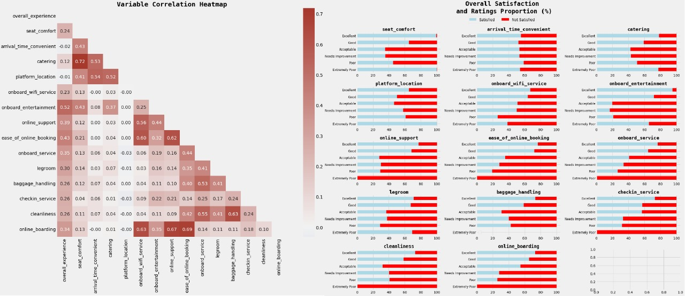

# Introduction
The objective of this problem is to understand which parameters play an important role in swaying passenger feedback towards a positive scale. You are provided test data containing the travel data and the survey data of passengers. Both the test data and the train data are collected at the same time and belong to the same population.

# Lesson learned

Weak correlation does not imply weak predictor.

# Data Preparation and Engineering
##Travel columns
- Travel columns
  - Null values
    - `age`, `gender` - mode
    - `delay` - drop
    - `customer_type` - fill with "disloyal"
    - `type_travel` - if class == eco then personal, else business
  - Outliers
    - `delay` use z score
  - Scaler/normalize/standardize `age`, `distance`, `delay`
  - OHE `gender`, `type_travel`
  - Label encode `customer_type`, `travel_class`
  - Drop `id` -- unimportant
  - Drop one of the `delay` -- strong correlation
- Survey columns
  - Null values - mode
  - OHE `seat_class`
  - Label encode everything else

# Modelling and Result

XGBoost perform significantly better on combined training dataset compared to logistic regression.

Feature importance plot indicates that `seat_comfort` is the most importance feature and `catering` is the least importance one.

Deep learning training history.

# Conclusion

We've created 3 different models: logistic regression, XGBoost, and deep learning with 2 different data schemas (using only travel data and using combined data). The best result (accuracy wise) is the deep learning model with accuracy above 94%.
